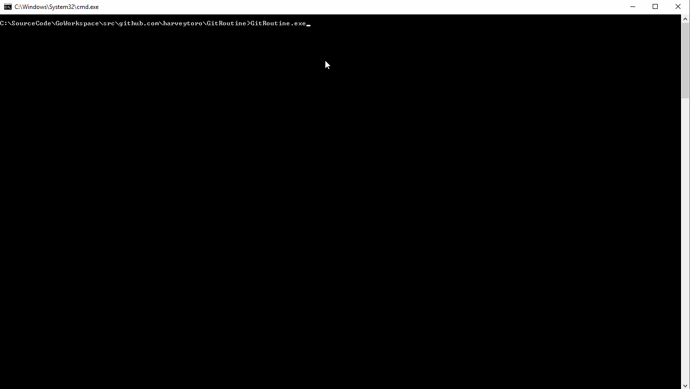

# GitRoutine

**Console based Git UI, to easily manage multiple repositories.**



More of a project to get me learning some Go.

## Usage 

Add repositories to config.json

```JSON
{
"Repositories": [
	{
		"Name": "<NAME FOR REPOSITORY> TIL",
		"Path": "<PATH TO REPOSITORY E.G c:\\SourceCode\\TIL>"
	}, 
    ...
]
}
```